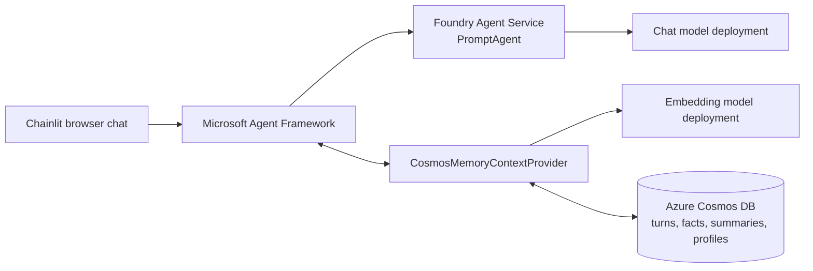
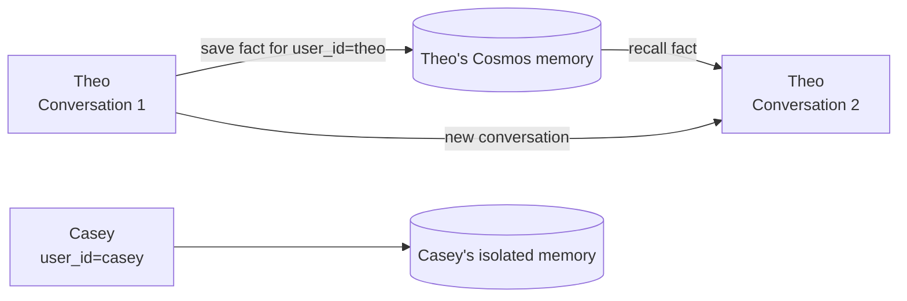

# Long-term memory for Microsoft Foundry agents with Azure Cosmos DB

A complete, `azd up`-deployable sample that gives a prompt agent in **Microsoft
Foundry Agent Service** durable, user-scoped memory powered by **Azure Cosmos DB**
and **Microsoft Agent Framework**.

> **Does `azd up` deploy everything?** Yes. It provisions the Foundry account and
> project, chat and embedding model deployments, Azure Cosmos DB, and RBAC. A
> post-provision hook then creates the PromptAgent in Foundry Agent Service and
> runs a live two-conversation memory test. The only local component is the
> optional Chainlit browser UI that you start after deployment.

## What `azd up` does

| Component | Created by | Purpose |
|---|---|---|
| Azure resource group | Azure Developer CLI | Contains the sample resources |
| Microsoft Foundry account and project | Bicep | Hosts models and Agent Service |
| `gpt-4o-mini` deployment | Bicep | Generates agent responses and extracts memory |
| `text-embedding-3-large` deployment | Bicep | Embeds memory for semantic retrieval |
| Azure Cosmos DB for NoSQL account | Bicep | Stores turns and derived memory |
| `ai_memory` database | Bicep | Memory toolkit database |
| Vector and full-text search capabilities | Bicep | Hybrid memory retrieval |
| Foundry and Cosmos DB role assignments | Bicep | Keyless data-plane access for the deploying identity |
| `cosmos-memory-sample-agent` PromptAgent | Post-provision Python hook | The deployed Foundry Agent Service agent |
| Python virtual environment and dependencies | Post-provision hook | Runs the sample and validation |
| Cross-conversation memory test | Post-provision hook | Makes deployment fail if live recall is not demonstrated |

Cosmos DB local authentication is disabled. The code uses
`DefaultAzureCredential` and Microsoft Entra ID instead of account keys or
connection strings.

## Architecture



The provider runs automatically around each agent call:

- `before_run` retrieves relevant memory from Cosmos DB and adds it to the agent
  context.
- `after_run` stores the new turn and starts fact, summary, and profile extraction.

Conversation identity and memory identity are deliberately separate:



A new Agent Framework session starts a clean conversation. Keeping the same
`user_id` lets memory follow the user; changing it creates a separate retrieval
scope.

## Prerequisites

- [Azure Developer CLI (`azd`)](https://learn.microsoft.com/azure/developer/azure-developer-cli/install-azd)
- [Azure CLI (`az`)](https://learn.microsoft.com/cli/azure/install-azure-cli)
- Python 3.11 or later
- An Azure subscription with permission to create resources and assign roles
- Foundry model quota in the selected region

Because the template creates role assignments, use an identity with **Owner** or
**User Access Administrator** plus permission to create the resources. Model
availability and quota vary by region. The sample has been validated in
`swedencentral`; choose another region only after confirming that both model
deployments are available there.

## Deploy

Clone your fork and sign in:

```powershell
git clone https://github.com/TheovanKraay/foundry-cosmos-memory.git
cd foundry-cosmos-memory

az login
azd auth login
azd up
```

`azd up` prompts for an environment name, subscription, and region. Provisioning
and the post-provision validation can take several minutes.

A successful deployment ends with output similar to:

```text
[Conversation 1] Teaching the agent a durable fact...
[Flush] Waiting for background memory extraction to persist...
[Conversation 2] New conversation, same user. Asking it to recall...

Recalled peanut allergy in a NEW conversation: True
PASS - Cosmos memory was injected into the Foundry agent run.
```

The test generates a new `memory-test-<uuid>` user every time. This prevents old
data from producing a false pass. If the second conversation does not mention the
newly taught peanut allergy, the script exits nonzero and `azd up` fails.

## Start the browser chat

The cloud resources and agent are now deployed. Export the azd outputs to a local
`.env` file and start Chainlit.

### Windows PowerShell

```powershell
azd env get-values | Set-Content .env
.\.venv\Scripts\python.exe -m chainlit run src/chat.py
```

### macOS or Linux

```bash
azd env get-values > .env
. .venv/bin/activate
python -m chainlit run src/chat.py
```

Open [http://localhost:8000](http://localhost:8000). The UI is local, but every
agent run, model call, and memory operation uses the Azure resources deployed by
`azd up`.

Try this sequence:

1. Enter the demo user ID `theo`.
2. Send `Remember that my favorite color is vermilion.`
3. Wait for **Save long-term memory** to finish.
4. Select **New conversation**.
5. Ask `What is my favorite color?`
6. Enter `/user casey`, then ask the same question to demonstrate isolation.

Do not enter personal, confidential, or sensitive information. Typed user IDs are
only a simple demonstration mechanism; production applications should derive the
memory identity from an authenticated principal.

The app also supports:

- `/new` - create a fresh conversation for the current memory user
- `/user <id>` - switch memory users and create a fresh conversation
- `/help` - show the available commands

## Re-run the live test

The `.env` exported above contains resource names and endpoints, not secrets.

```powershell
.\.venv\Scripts\python.exe -m src.run_memory_test
```

```bash
. .venv/bin/activate
python -m src.run_memory_test
```

## Key integration

[`src/agent_runtime.py`](src/agent_runtime.py) constructs the same runtime used by
the browser app and deterministic test:

```python
memory = CosmosMemoryContextProvider(
	cosmos_endpoint=config.COSMOS_ENDPOINT,
	cosmos_database=config.COSMOS_DATABASE,
	foundry_endpoint=config.FOUNDRY_PROJECT_ENDPOINT,
	embedding_model=config.EMBEDDING_MODEL,
	chat_model=config.CHAT_MODEL,
	credential=credential,
	memory_types=["fact", "procedural", "episodic"],
)

agent = FoundryAgent(
	project_endpoint=config.FOUNDRY_PROJECT_ENDPOINT,
	agent_name=config.FOUNDRY_AGENT_NAME,
	agent_version=os.getenv("FOUNDRY_AGENT_VERSION"),
	credential=credential,
	context_providers=[memory],
)
```

Each conversation gets a new session while the stable user ID is stored in the
provider's own state:

```python
session = agent.create_session()
session.state.setdefault(memory.source_id, {})["user_id"] = user_id
```

## Use existing Azure resources

To skip provisioning, copy [.env.example](.env.example) to `.env`, fill in the
existing Cosmos DB and Foundry project values, install `requirements.txt`, and run:

```powershell
python -m src.create_agent
python -m src.run_memory_test
```

Persist the `FOUNDRY_AGENT_NAME` and `FOUNDRY_AGENT_VERSION` printed by the first
command in `.env` before running the test.

## Troubleshooting

### Model quota or unsupported SKU

Use a region with quota for both `gpt-4o-mini` and
`text-embedding-3-large`. The chat deployment uses `GlobalStandard`; the embedding
deployment uses regional `Standard`. You can adjust names, versions, SKU, and
capacity in [infra/main.bicep](infra/main.bicep).

### Role assignment failed

The deploying identity must be allowed to create Azure role assignments. Use
Owner or User Access Administrator at the subscription or target resource-group
scope.

### Agent Service returns authorization errors

Role propagation can take several minutes. The template assigns **Foundry User**
at both account and project scope and **Cognitive Services OpenAI User** at the
account scope. Retry `azd up` after propagation completes.

### The memory test is inconclusive

Run it again, then inspect the `ai_memory` database in Cosmos DB Data Explorer.
Look for turn and extracted fact documents under the generated
`memory-test-<uuid>` identity. The test calls `flush()` before recall so background
extraction completes before the second conversation.

## Project layout

```text
.
|-- azure.yaml                 # azd project and lifecycle hook
|-- infra/
|   |-- main.bicep             # Foundry, models, Cosmos DB, and RBAC
|   `-- main.parameters.json
|-- hooks/
|   |-- postprovision.ps1      # Windows setup, agent creation, live test
|   `-- postprovision.sh       # POSIX setup, agent creation, live test
|-- src/
|   |-- agent_runtime.py       # Shared agent, provider, and session lifecycle
|   |-- chat.py                # Chainlit browser experience
|   |-- config.py              # Environment-driven configuration
|   |-- create_agent.py        # Idempotent PromptAgent creation
|   `-- run_memory_test.py     # Fresh-user cross-conversation test
|-- .chainlit/config.toml
|-- .env.example
`-- requirements.txt
```

## Clean up

```bash
azd down --purge
```

`--purge` also removes the soft-deleted Foundry account so its name is released.

## Related reading

- [Native Agent Memory for Microsoft Agent Framework, Powered by Azure Cosmos DB](https://devblogs.microsoft.com/cosmosdb/native-agent-memory-for-microsoft-agent-framework-powered-by-azure-cosmos-db/)
- [Microsoft Agent Framework documentation](https://learn.microsoft.com/agent-framework/)
- [Vector search in Azure Cosmos DB for NoSQL](https://learn.microsoft.com/azure/cosmos-db/nosql/vector-search)
